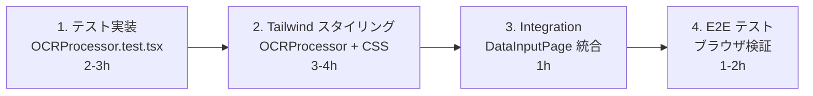

/\*\*

- Phase 4 完全実装計画書 (Revised)
-
- Date: 2025-11-02
- Tailwind CSS ベースのスタイリング戦略を含む再構成版
- 技術スタック: React 19 + TypeScript + Vite + Tailwind CSS + Tesseract.js
  \*/

# Phase 4 完全実装計画書 (Revised)

## プロジェクト全体像

```
Phase 4: OCR データ入力機能実装

Phase 4-1: OCR エンジン統合 ✅ 完了
├── ocrEngine.ts (Tesseract.js ラッパー)
├── imageProcessor.ts (Canvas API 画像処理)
├── useOCR.ts (React フック)
└── すべてのテスト完了

Phase 4-2: データ入力 UI コンポーネント (進行中 50%)
├── OCRProcessor.spec.md ✅ 完了
├── OCRProcessor.tsx ✅ 実装完了 (Tailwind CSS なし)
├── OCRProcessor.test.tsx ⏳ 次
├── OCRProcessor スタイリング (Tailwind CSS)
└── 統合テスト

Phase 4-3: 結果編集機能 (計画)
├── ResultEditor.spec.md
├── ResultEditor.tsx (Tailwind CSS)
├── ResultEditor.test.tsx
└── 統合テスト

Phase 4-4: 完全統合テスト (計画)
├── DataInputPage integration
├── E2E テスト
└── UX 検証
```

## Phase 4-2 詳細実装計画

### 現在の状態

```
✅ Spec: OCRProcessor.spec.md (304 行)
✅ Implementation: OCRProcessor.tsx (370 行) - Tailwind CSS なし
⏳ Tests: OCRProcessor.test.tsx - 次
⏳ Styling: Tailwind CSS クラス - 次
```

### 実装順序と依存関係



---

## 📋 実装スケジュール

### **Task 1: OCRProcessor.test.tsx 実装** (予定: 2-3h)

**目的**: 10 個のテストケース実装、全テスト合格

**テストケース一覧**:

| ID     | テスト項目                      | 説明                    |
| ------ | ------------------------------- | ----------------------- |
| TC-001 | コンポーネント初期化            | 初期状態確認            |
| TC-002 | ファイル選択                    | 画像ファイル選択処理    |
| TC-003 | バリデーション (ファイル型)     | 無効なファイル型の拒否  |
| TC-004 | バリデーション (ファイルサイズ) | 5MB 超過の拒否          |
| TC-005 | OCR 処理開始                    | processImage 呼び出し   |
| TC-006 | 進捗表示                        | プログレスバー更新      |
| TC-007 | 結果表示                        | 認識結果のレンダリング  |
| TC-008 | エラーハンドリング              | エラーメッセージ表示    |
| TC-009 | キャンセル処理                  | 処理中断 + 状態リセット |
| TC-010 | 結果編集                        | テキスト編集機能        |

**実装方針**:

- `@testing-library/react` 使用
- `useOCR` フックのモック化
- ファイル選択のシミュレーション
- 段階的テスト実装 (TC-001 → TC-010)

**成功条件**:

- [ ] 全テストケース実装
- [ ] 10/10 テスト合格
- [ ] 0 Lint エラー
- [ ] カバレッジ: 80%+

---

### **Task 2: Tailwind CSS スタイリング** (予定: 3-4h)

**ファイル構成**:

```
src/components/DataInput/
├── OCRProcessor.tsx (更新: Tailwind クラス追加)
└── OCRProcessor.styles.ts (新規: カスタムクラス定義)
```

**実装内容**:

#### 2-1. Tailwind CSS クラス設計

**セクション別クラス設計**:

```typescript
// Upload Area
className="bg-slate-50 border-2 border-dashed border-slate-300 rounded-lg
           p-8 cursor-pointer hover:bg-slate-100 transition-colors"

// Preview Image
className="w-full max-h-64 object-cover rounded-md"

// Progress Bar
className="w-full bg-slate-200 rounded-full h-2 overflow-hidden"
className="bg-blue-600 h-full transition-all duration-300" // fill

// Results List
className="space-y-4"
className="bg-white border border-slate-200 rounded-lg p-4 shadow-sm"

// Buttons
className="px-4 py-2 rounded-lg font-medium transition-colors
          bg-blue-600 text-white hover:bg-blue-700"

// Error Alert
className="bg-red-50 border border-red-200 text-red-700 p-4 rounded-lg"

// Modal Editor
className="fixed inset-0 bg-black/50 flex items-center justify-center z-50"
className="bg-white rounded-lg shadow-xl max-w-2xl w-full mx-4"
```

#### 2-2. カスタムコンポーネント (clsx + tailwind-merge)

```typescript
// src/components/DataInput/OCRProcessor.styles.ts
import { clsx, type ClassValue } from "clsx";
import { twMerge } from "tailwind-merge";

export const cn = (...inputs: ClassValue[]) => twMerge(clsx(inputs));

export const styles = {
  container: cn("space-y-6"),

  uploadArea: cn(
    "bg-slate-50 border-2 border-dashed border-slate-300 rounded-lg",
    "p-8 cursor-pointer hover:bg-slate-100 transition-colors",
    "flex flex-col items-center justify-center min-h-64"
  ),

  preview: cn("w-full space-y-2"),
  previewImage: cn("w-full max-h-64 object-cover rounded-md"),
  filename: cn("text-sm text-slate-600"),

  progressBar: cn("w-full bg-slate-200 rounded-full h-2 overflow-hidden"),
  progressFill: cn(
    "bg-gradient-to-r from-blue-600 to-cyan-600 h-full transition-all duration-300"
  ),
  progressText: cn(
    "flex justify-between items-center mt-2 text-sm text-slate-600"
  ),

  resultsList: cn("space-y-3"),
  resultItem: cn(
    "bg-white border border-slate-200 rounded-lg p-4 shadow-sm hover:shadow-md transition-shadow"
  ),
  resultHeader: cn("flex justify-between items-start mb-2"),
  resultName: cn("font-semibold text-slate-900"),
  confidence: cn("text-sm text-slate-600 bg-slate-100 px-2 py-1 rounded"),
  resultText: cn(
    "text-slate-700 font-mono text-sm leading-relaxed break-words"
  ),

  errorAlert: cn(
    "bg-red-50 border border-red-200 text-red-700 p-4 rounded-lg flex justify-between items-start"
  ),

  modal: cn(
    "fixed inset-0 bg-black/50 flex items-center justify-center z-50 p-4"
  ),
  modalContent: cn(
    "bg-white rounded-lg shadow-xl max-w-2xl w-full max-h-96 overflow-y-auto"
  ),

  actionButtons: cn("flex gap-3 justify-end"),
  buttonPrimary: cn(
    "px-6 py-2 bg-blue-600 text-white rounded-lg font-medium hover:bg-blue-700 transition-colors"
  ),
  buttonSecondary: cn(
    "px-6 py-2 bg-slate-200 text-slate-900 rounded-lg font-medium hover:bg-slate-300 transition-colors"
  ),
};
```

#### 2-3. レスポンシブデザイン

```typescript
// Mobile (sm: 640px)
className = "flex flex-col gap-2 sm:flex-row";

// Tablet (md: 768px)
className = "grid grid-cols-1 md:grid-cols-2 gap-4";

// Desktop (lg: 1024px)
className = "grid grid-cols-1 lg:grid-cols-3 gap-6";

// Extra Large (xl: 1280px)
className = "max-w-6xl mx-auto";
```

#### 2-4. ダークモード対応 (将来)

```typescript
// 基本パターン
className = "bg-slate-50 dark:bg-slate-900 text-slate-900 dark:text-slate-50";
className = "border-slate-300 dark:border-slate-700";
```

**実装進捗チェック**:

- [ ] styles.ts ファイル作成
- [ ] Tailwind クラス定義完成
- [ ] OCRProcessor.tsx に適用
- [ ] すべての UI 要素にクラス適用
- [ ] レスポンシブ検証 (mobile/tablet/desktop)
- [ ] 0 Lint エラー

---

### **Task 3: DataInputPage への統合** (予定: 1h)

**ファイル**: `src/pages/DataInputPage.tsx`

**統合内容**:

```typescript
import { OCRProcessor } from "../components/DataInput/OCRProcessor";
import { useTemplate } from "../hooks/useTemplate";

export const DataInputPage: FC = () => {
  const { currentTemplate } = useTemplate();

  const handleOCRComplete = (results: OCRRegionResult[]) => {
    // 結果処理
  };

  const handleOCRError = (error: Error) => {
    // エラー処理
  };

  return (
    <div className="container mx-auto py-8">
      <OCRProcessor
        template={currentTemplate}
        onComplete={handleOCRComplete}
        onError={handleOCRError}
      />
    </div>
  );
};
```

**チェックリスト**:

- [ ] OCRProcessor インポート
- [ ] useTemplate フック統合
- [ ] コールバック実装
- [ ] テスト実行 (統合テスト)

---

### **Task 4: E2E テスト・ブラウザ検証** (予定: 1-2h)

**検証項目**:

```
1. 画像アップロード
   ✓ ファイル選択 → プレビュー表示
   ✓ バリデーション: 無効なファイル型
   ✓ バリデーション: 大きすぎるファイル

2. OCR 処理
   ✓ 処理開始 → プログレス更新 → 完了
   ✓ 結果表示: 複数領域の結果
   ✓ 結果修正: テキスト編集

3. エラーハンドリング
   ✓ エラーメッセージ表示
   ✓ 再試行ボタン動作
   ✓ キャンセル処理

4. UI/UX
   ✓ レスポンシブ: モバイル表示
   ✓ レスポンシブ: タブレット表示
   ✓ レスポンシブ: デスクトップ表示
   ✓ キーボードナビゲーション
   ✓ アクセシビリティ: スクリーンリーダー
```

**実行方法**:

```bash
# 開発サーバー起動
bun dev

# ブラウザで http://localhost:3000 を開く
# DataInputPage で各シナリオをテスト
```

---

## 📊 リソース見積もり

### 作業時間の見積もり

```
Task 1 (テスト実装)          : 2-3 時間  ⏳ 次
Task 2 (Tailwind スタイリング) : 3-4 時間  ⏳ その後
Task 3 (統合)                : 1 時間    ⏳ その後
Task 4 (E2E テスト)           : 1-2 時間  ⏳ 最後
──────────────────────────────────
合計                        : 7-10 時間

現在のコード行数: ~370 (OCRProcessor) + 200 (styles) = ~570 行
最終テストライン: ~200 行
合計: ~770 行
```

### 実装チェックリスト

#### Phase 4-2 完成条件

```
実装:
  ✅ OCRProcessor.spec.md
  ✅ OCRProcessor.tsx (ロジック完成)
  ⏳ OCRProcessor.tsx (Tailwind スタイリング)
  ⏳ OCRProcessor.styles.ts

テスト:
  ⏳ OCRProcessor.test.tsx (10 テスト)
  ⏳ 全テスト合格 (10/10)

統合:
  ⏳ DataInputPage 統合
  ⏳ E2E テスト完了

品質:
  ✅ TypeScript: 0 エラー
  ⏳ Lint: 0 エラー
  ⏳ テストカバレッジ: 80%+
  ⏳ アクセシビリティ: WCAG 2.1 AA
```

---

## 🔧 Tailwind CSS 実装パターン

### 1. 基本的な組み合わせ

```typescript
// ボタン (primary)
const btnPrimary =
  "px-4 py-2 bg-blue-600 text-white rounded-lg font-medium hover:bg-blue-700 active:bg-blue-800 disabled:opacity-50 disabled:cursor-not-allowed transition-colors";

// ボタン (secondary)
const btnSecondary =
  "px-4 py-2 bg-slate-200 text-slate-900 rounded-lg font-medium hover:bg-slate-300 active:bg-slate-400 transition-colors";

// カード
const card =
  "bg-white border border-slate-200 rounded-lg shadow-sm p-4 hover:shadow-md transition-shadow";

// インプット
const input =
  "w-full px-3 py-2 border border-slate-300 rounded-lg focus:outline-none focus:ring-2 focus:ring-blue-500 focus:border-transparent";
```

### 2. 状態管理 (disabled, loading, error)

```typescript
// disabled 状態
className={cn(
  baseClass,
  disabled && 'opacity-50 cursor-not-allowed'
)}

// loading 状態
className={cn(
  baseClass,
  loading && 'animate-pulse'
)}

// error 状態
className={cn(
  'border-slate-300',
  error && 'border-red-500 bg-red-50'
)}
```

### 3. レイアウト (Flexbox + Grid)

```typescript
// 水平スタック
className = "flex items-center gap-3";

// 垂直スタック
className = "flex flex-col gap-3";

// グリッド
className = "grid grid-cols-2 gap-4 md:grid-cols-3 lg:grid-cols-4";

// スペース
className = "space-y-4"; // vertical spacing
className = "space-x-3"; // horizontal spacing
```

### 4. レスポンシブ

```typescript
// ブレークポイント
// sm: 640px
// md: 768px
// lg: 1024px
// xl: 1280px
// 2xl: 1536px

className = "text-sm md:text-base lg:text-lg";
className = "p-2 md:p-4 lg:p-6";
className = "grid grid-cols-1 md:grid-cols-2 lg:grid-cols-3";
```

---

## 📁 ファイル構成

### Phase 4-2 完成後

```
src/components/DataInput/
├── OCRProcessor.tsx              (実装: ロジック + Tailwind クラス)
├── OCRProcessor.spec.md          (仕様書)
├── OCRProcessor.test.tsx         (テスト)
├── OCRProcessor.styles.ts        (Tailwind クラス定義)
└── OCRProcessor.module.css       (削除: 不要)

src/hooks/
├── useOCR.ts                     (既存)
├── useOCR.spec.md               (既存)
└── useOCR.test.ts               (既存)

src/pages/
└── DataInputPage.tsx             (更新: OCRProcessor 統合)

docs/05_logs/2024_11/20241103/
├── 01_phase4-1-completion.md
└── 02_phase4-2-ocr-processor-implementation.md (更新: Tailwind 戦略追記)
```

---

## 🚀 開始手順

### Step 1: テスト実装を開始

```bash
# 新しいテストファイルを作成
touch src/components/DataInput/OCRProcessor.test.tsx

# テストケース実装を開始 (TC-001 から TC-010)
```

**実装順序**:

1. インポート + モック設定
2. TC-001: 初期化テスト
3. TC-002 ～ 004: ファイル選択・バリデーション
4. TC-005 ～ 007: OCR 処理・進捗・結果
5. TC-008 ～ 010: エラー・キャンセル・編集

### Step 2: Tailwind スタイリング

```bash
# styles ファイル作成
touch src/components/DataInput/OCRProcessor.styles.ts

# OCRProcessor.tsx にスタイルを適用
# - upload-area
# - preview
# - progress-bar
# - results-list
# - buttons
# - modals
```

### Step 3: 統合テスト

```bash
# DataInputPage.tsx を更新
# OCRProcessor を統合

bun test # テスト実行
bun dev  # ブラウザ検証
```

---

## ✅ 成功の定義

### Phase 4-2 完成条件

```
テスト:
  ✅ 10/10 テスト合格
  ✅ 総テスト: 155+ pass

コード品質:
  ✅ Lint: 0 エラー
  ✅ TypeScript: 0 エラー
  ✅ カバレッジ: 80%+

UI/UX:
  ✅ レスポンシブ: 3 サイズで動作
  ✅ アクセシビリティ: WCAG 2.1 AA
  ✅ パフォーマンス: 画像処理速度 OK

統合:
  ✅ DataInputPage との統合完了
  ✅ テンプレート連携確認
  ✅ E2E ユースケーステスト完了
```

---

## 📅 次のマイルストーン

### Phase 4 完成後

- ✅ Phase 4-1: OCR エンジン統合 (完了)
- ⏳ Phase 4-2: データ入力 UI (進行中 → 完成予定)
- ⏳ Phase 4-3: 結果編集機能 (計画)
- ⏳ Phase 4-4: 統合テスト (計画)

### Phase 5 以降の予定

- Phase 5: データ出力・保存機能
- Phase 6: パフォーマンス最適化
- Phase 7: 本番環境デプロイ準備
- Phase 8: ユーザーテスト・フィードバック

---

## 📝 参考リソース

### Tailwind CSS

- [公式ドキュメント](https://tailwindcss.com/docs)
- [コンポーネント例](https://tailwindcss.com/docs/components)
- [レスポンシブ設計](https://tailwindcss.com/docs/responsive-design)

### React Testing Library

- [公式ドキュメント](https://testing-library.com/docs/react-testing-library/intro/)
- [テストパターン](https://testing-library.com/docs/queries/about)

### アクセシビリティ

- [WCAG 2.1](https://www.w3.org/WAI/WCAG21/quickref/)
- [ARIA Authoring Practices](https://www.w3.org/WAI/ARIA/apg/)
